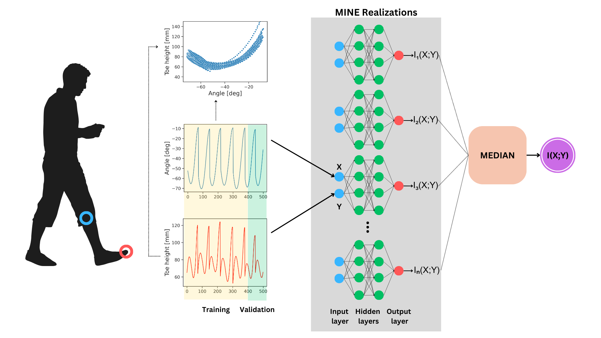

<p align="center">
  
</p>

<h1 align='center'>Mutual Information Between Joint Angles and Toe Height in Healthy Subjects</h1>

[](https://www.python.org)
[](https://pytorch.org)
[](https://opensource.org/licenses/MIT)

## biomechanics-mine: Mutual information neural estimation (MINE) code used for the article

Understanding the relationship between the position of the foot and the lower limb joint angles
during normal gait is critical for the identification of the mechanisms involved in pathological gait.
In this article, we introduce a novel framework that characterizes this relationship using mutual information
in healthy subjects. The nonlinear connection between these variables is quantified using mutual information,
and the MINE algorithm is used for precise estimation.

### Citation:

```
@article{restrepo_mi_bomechanics2023,
  title={Mutual Information Between Joint Angles and Toe Height in Healthy Subjects},
  author={Juan F. Restrepo, Mauricio Riveras, Gastón Schlotthauer, Paola Catalfamo},
  journal={},
  pages={},
  year={},
}
```

## Methodology Diagram:

<p align="center">

<br><br>
<b>Figure 1.</b> Methodology Diagram to estimate mutual information between the toe height and the ipsilateral knee joint angle.
</p>

## Usage

#### Install

```bash
git clone https://github.com/jrestrepo86/biomechanics-mine.git
cd biomechanics-mine/
pip install -e .
```

#### Uninstall

```bash
pip uninstall mine
```

#### Examples:

- [A complete test of this module using Gaussian random variables](testMineGaussian.py)
- [A complete test of this module using gait signals](testMineGait.py)

##### Fast test using Gaussian random variables:

```py
import numpy as np
from matplotlib import pyplot as plt

try:
    from mine.mine import Mine
except ImportError:
    from .mine.mine import Mine

# Generate Gaussian Data
rho = 0.5
mu = np.array([0, 0])
nDataPoints = 10000
cov_matrix = np.array([[1, rho], [rho, 1]])
joint_samples_train = np.random.multivariate_normal(
    mean=mu, cov=cov_matrix, size=(nDataPoints, 1)
)
X = np.squeeze(joint_samples_train[:, :, 0])
Y = np.squeeze(joint_samples_train[:, :, 1])

mi_teo = -0.5 * np.log(1 - rho**2)  # Theoretical MI Value

# Mine
model_params = {"hidden_dim": 150, "num_hidden_layers": 3, "afn": "elu", "loss": "mine"}
train_params = {
    "batch_size": "full",
    "max_epochs": 5000,
    "val_size": 0.2,
    "lr": 1e-3,
    "lr_factor": 0.1,
    "lr_patience": 100,
    "stop_patience": 200,
    "stop_min_delta": 0.0,
    "verbose": True,
}
# Generate model
model = Mine(X, Y, **model_params)
# Train models
model.fit(**train_params)
# Get mi estimation
mi = model.get_mi()
# Get loss and mi curves
val_loss, val_loss_smoothed, val_mi, test_mi = model.get_curves()
# plot
fig, axs = plt.subplots(2, 1, sharex=True, sharey=False)
axs[0].plot(val_loss, "b", label="Validation loss")
axs[0].plot(val_loss_smoothed, "r", label="Smoothed validation loss")
axs[0].set_ylabel("Loss")
axs[0].legend()
axs[1].plot(val_mi, "b", label="Validation MI")
axs[1].plot(test_mi, "r", label="Test MI")
axs[1].hlines(mi_teo, 0, test_mi.size, "k", linestyles="dashed", label="True MI")
axs[1].set_xlabel("epochs")
axs[1].set_ylabel("MI")
axs[1].legend()
fig.suptitle(
    f"Mutual information neural estimation,\n Theoretical MI={mi_teo:.3f}, Estimated MI={mi:.3f} ",
    fontsize=13,
)
plt.show()
```

## Bibliography

```
@inproceedings{belghazi2018mutual,
  title={Mutual information neural estimation},
  author={Belghazi, Mohamed Ishmael and Baratin, Aristide and Rajeshwar,
          Sai and Ozair, Sherjil and Bengio, Yoshua and Courville, Aaron and Hjelm, Devon},
  booktitle={International conference on machine learning},
  pages={531--540},
  year={2018},
  organization={PMLR}
},
@article{choi2020regularized,
  title={Regularized mutual information neural estimation},
  author={Choi, Kwanghee and Lee, Siyeong},
  year={2020}
},
@inproceedings{choi2022combating,
    title={Combating the instability of mutual information-based losses via regularization},
    author={Choi, Kwanghee and Lee, Siyeong},
    booktitle={Uncertainty in Artificial Intelligence},
    pages={411--421},
    year={2022},
    organization={PMLR}
},
@inproceedings{cristiani2020leakage,
  title={Leakage assessment through neural estimation of the mutual information},
  author={Cristiani, Valence and Lecomte, Maxime and Maurine, Philippe},
  booktitle={Applied Cryptography and Network Security Workshops: ACNS 2020 Satellite Workshops,
            AIBlock, AIHWS, AIoTS, Cloud S\&P, SCI, SecMT, and SiMLA, Rome,
            Italy, October 19--22, 2020, Proceedings 18},
  pages={144--162},
  year={2020},
  organization={Springer}
},
```
